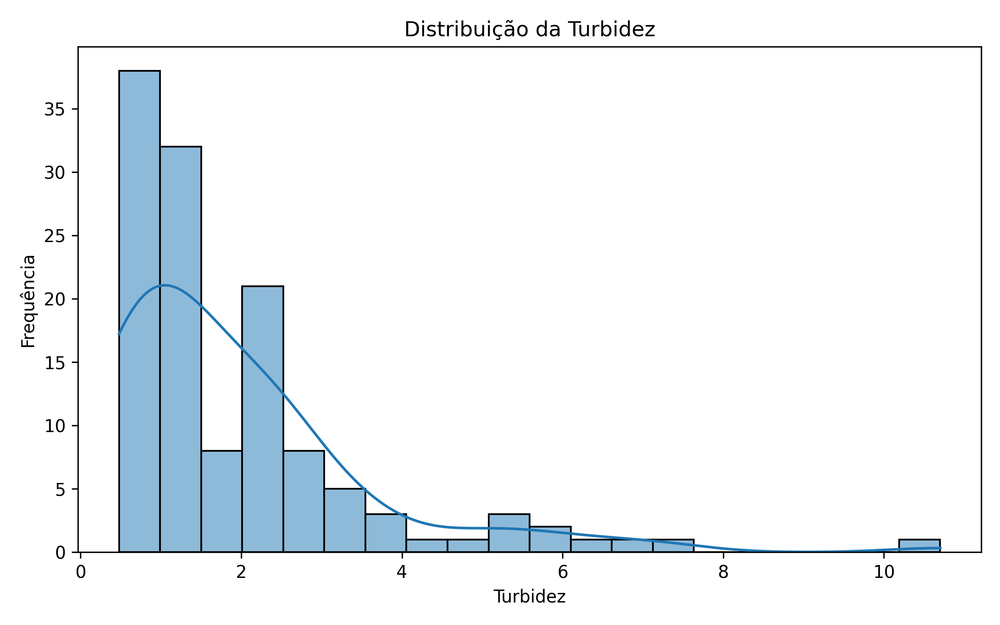
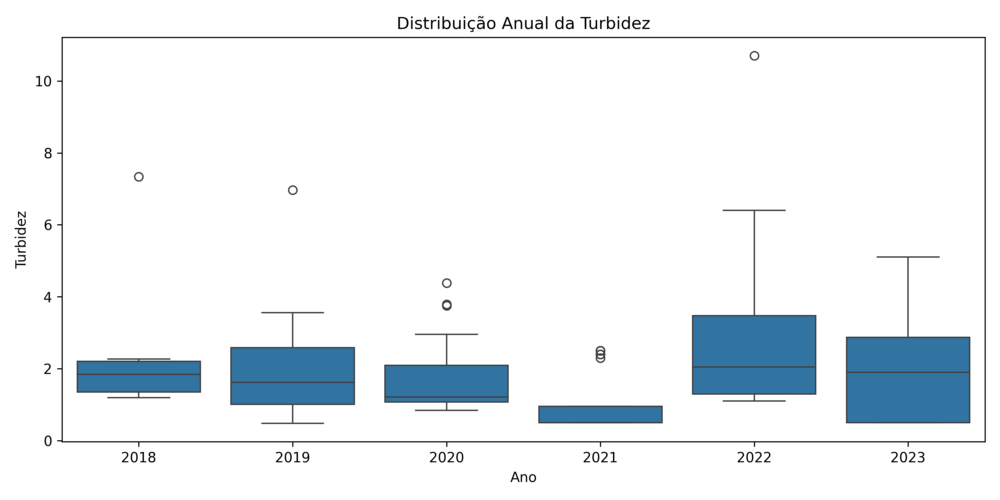
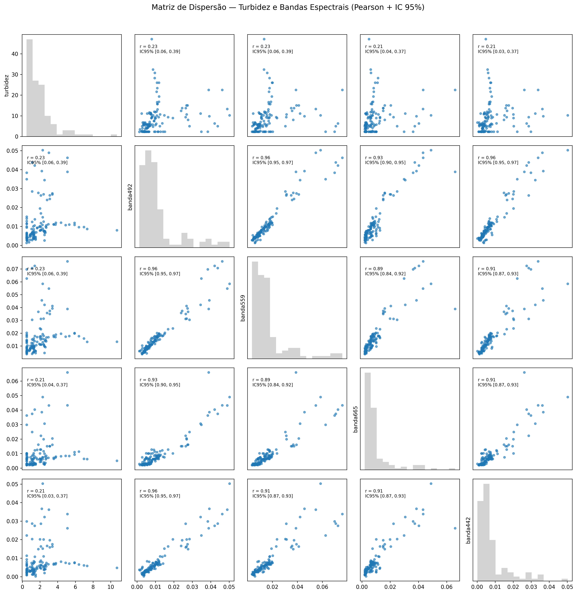

# Machine Learning para Predição da Turbidez da Água com Sentinel-2

Este projeto aplica técnicas de **Ciência de Dados** e **Machine Learning supervisionado**
para estimar a **turbidez da água (NTU)** a partir de bandas espectrais do satélite **Sentinel-2**,
com foco em interpretação ambiental e validação estatística dos modelos.

---

## 🎯 Objetivo

Desenvolver modelos preditivos de turbidez utilizando dados espectrais do Sentinel-2,
avaliando o desempenho de:
- Bandas espectrais individuais
- Razões de bandas
- Conjunto completo de bandas

---

## 🗂️ Base de Dados

- Dados in situ de qualidade da água (2018–2023):
  - Turbidez
  - Clorofila-a (chla)
  - Feofitina
  - SST
  - Sólidos Totais (ST)
  - Sólidos Dissolvidos Totais (SDT)
  - Cor verdadeira
- Bandas espectrais do Sentinel-2:
  - 442, 492, 559, 665, 704, 739, 780, 833, 864, 1610 e 2186 nm

---

## 🔎 Metodologia

1. Análise exploratória dos dados (EDA)
2. Estatísticas descritivas da turbidez
3. Análise de correlação entre parâmetros ambientais e bandas espectrais
4. Modelagem preditiva com:
   - Random Forest
   - Support Vector Machine (SVM)
   - Decision Tree
5. Avaliação dos modelos com:
   - RMSE
   - Correlação de Pearson (r)
   - MAPE
6. Aplicação espacial do melhor modelo para geração de mapas de turbidez

---

## 📊 Análise Exploratória da Turbidez

A distribuição da turbidez apresenta assimetria positiva, com predominância de valores
baixos e ocorrência de eventos extremos.

### Distribuição da Turbidez

### Boxplot anual da turbidez

---

## 📈 Relação entre Turbidez e Bandas Espectrais

A análise de dispersão e correlação de Pearson evidencia correlação moderada entre
a turbidez e bandas do visível e red-edge, justificando a aplicação de modelos
multivariados de Machine Learning.

---

## 🤖 Modelagem Preditiva

Foram avaliados diferentes cenários de modelagem, considerando:
- Bandas individuais
- Razões de bandas
- Todas as bandas simultaneamente
- Dados com e sem remoção de outliers

O modelo **Random Forest** apresentou o melhor desempenho global.

---

## 🗺️ Mapas Espaciais de Turbidez

O melhor modelo foi aplicado espacialmente para gerar mapas de turbidez estimada,
permitindo a análise da variabilidade espacial e temporal do parâmetro.

---

## 🧪 Tecnologias Utilizadas

- Python
- Pandas, NumPy
- Scikit-learn
- Matplotlib, Seaborn
- Sensoriamento Remoto (Sentinel-2)

---

## 👤 Autor

**Willian Geraldo da Silva**  
Engenheiro Ambiental e Sanitarista  
Ciência de Dados e Machine Learning aplicados a Recursos Hídricos

## Autor
**Willian Geraldo da Silva**  
Engenheiro Ambiental e Sanitarista  
Ciência de Dados e Machine Learning Aplicado a Recursos Hídricos
